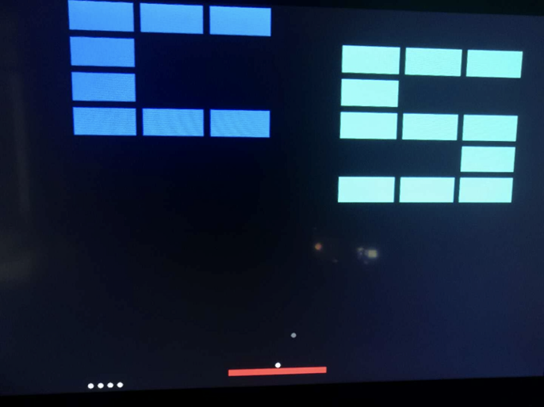

# Brick Game

A simple brick-destroy game implemented on FPGA.

`src/`: source code, `.sof`file, simulation wave form

`doc/`: document

`tool/`: a tool designed to generate code for brick patterns

