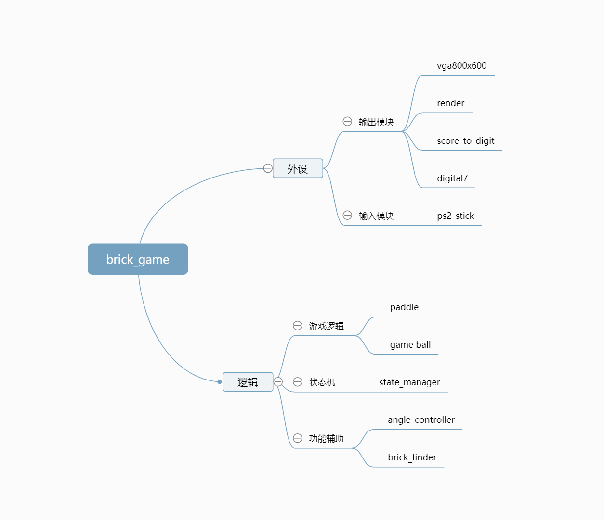
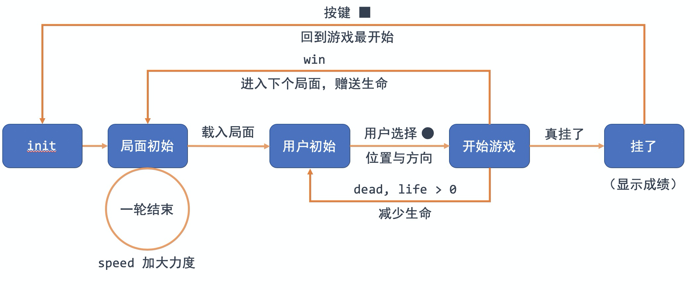
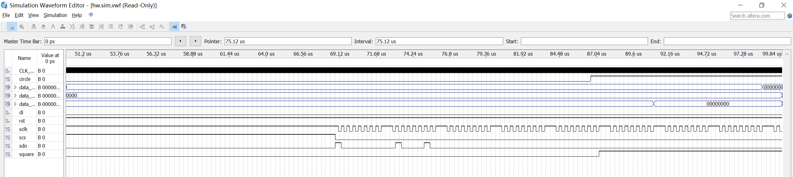
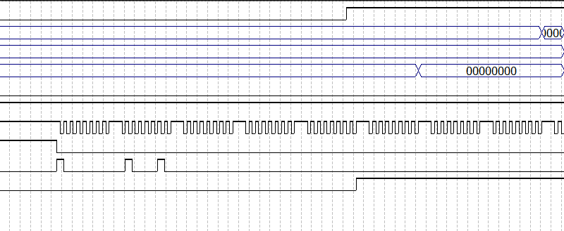

# 摇杆操纵打砖块

乐阳 2018011359		刘一芃 2018010138

## 实验介绍

打砖块是一种经典的电子游戏，游戏逻辑简单但富有趣味。玩家操控位于屏幕下方的反弹棒，让弹球保持在游戏画面内运动。弹球击打画面中的砖块以获得得分，局面所有砖块清除完毕则过关。

本实验使用VGA作为游戏的显示输出，使用PlayStation2手柄作为操作输入。

游戏在基础的打砖块逻辑之上添加了如下特性：

1. 用户可以自主选择弹球的初始发射位置（右摇杆）和发射角度（左摇杆），按〇键发射小球。
2. 砖块有不同耐久度，某些砖块需要多次击打才能消除。
3. 关卡系统。游戏共4关，每关有不同的砖块布局；当四关都通过时会回到第一关同时球速加快。
4. 当反弹棒未能接住球时失去一条生命。游戏开始时玩家共有六条生命，显示在画面左下角。每过一关会另外奖励一条生命，当全部生命耗尽时游戏结束。游戏结束后按□键开始新游戏。
5. 积分结算。玩家的积分等于球击打砖块的次数，显示在数码管上。

上述内容也是游戏的操作说明。详细的演示说明以及效果视频见展示PPT。


## 实验原理

程序的全部模块及其功能如下：



```
brick_game.sv			顶层模块

brick_finder.sv			坐标到砖块编号的映射
game_ball.sv			小球逻辑引擎

state_manager.sv		状态机控制模块

vga800x600.sv			显示器驱动
render.sv				不同物体的绘制
score_to_digit.sv		显示分数
digital_7				7段数码管显示

ps2_stick.sv			手柄外设驱动
paddle.sv				挡板位置处理
angle_controller.sv		手柄方向处理
```

下面详细叙述主要模块的运作原理。

### 状态机

状态机主要由五个状态组成，状态图如下：



下面阐述各个状态之间的关联：

1. 全局初始

   最初始的状态，负责对各模块进行初始化，自动进入下一个局面。

2. 局面初始

   在这个状态，载入局面数据，并进行生命值清算，计算下回合速度，并自动进入下一个局面。

3. 用户初始

   在这个状态，用户通过操作外设选定小球发射的初始位置与速度方向，在按下确认键后进入下一个状态。

4. 游戏进行

   在这个状态，用户通过外设与逻辑引擎交互，进行打砖块游戏，分为三个方向。

   当游戏胜利，即砖块被清空时，回到（2）局面初始状态，载入下一个局面并增加一条生命；

   当游戏失败，但仍有生命值剩余时，回到（3）用户初始状态，扣除一条生命并重新发射；

   当游戏失败，且无生命值剩余时，进入下一个状态。

5. 死亡清算

   在这个状态，冻结游戏引擎，在显示器上显示当前局面与分数。

   在按下确认键后回到（1）全局初始状态。

状态机实现于`state_manager`模块，状态机同时还担负着控制小球速度、维护生命系统和关卡系统的任务，当前状态的编号为信号`state`。

### 逻辑引擎

游戏核心功能实现在`game_ball`模块中。

#### 砖块设定

为了方便起见，将砖块位置固定，即从顶至低，从左至右排列。砖块大小为50\*100像素，共可设置8\*8个砖块。

这样可以建立从坐标到砖块编号的映射，即给定一个小球位置，可以计算出其对应的砖块编号与偏移量，

在 `brick_finder` 模块中实现。砖块局面的记录使用长为64的2bit数组，可以支持耐久度为0~3的砖块。耐久度为0代表消除，在屏幕上不显示，也不对小球运动产生影响。

#### 得分计算

维护一个当前总剩余耐久度的信号，当该信号减一时得分加一。得分信号`score`将传送至`score_to_digit`模块转化为四位10进制数（时序逻辑方式，避免除法），再转化为数码管显示信号。

#### 小球行为

小球行为主要分为四个部分：

1. 初始化

   通过手柄外设获取小球发射的位置与角度，并通过参数选择控制速度基本一致。小球的角度编号为信号`angle`，该信号由`angle_controller`模块根据外设信号来控制。共6种角度选择，对应不同的单位时间内小球的位移`dx,dy`。

2. 边界碰撞

   在边界碰撞中主要分为两种情景，即与顶部（上、左右）发生碰撞时直接反弹；与底部（下）发生碰撞时根据挡板位置决定反弹或死亡。挡板的行为实现于`paddle`模块。

3. 砖块碰撞

   通过 `brick_finder` 模块获取小球可能碰撞的砖块，并检测其是否存在。如有，根据碰撞角度（横向、纵向、斜向）进行反弹，同时更新对应的局面情况。

4. 小球移动

   若无事发生，则对小球进行移动，进入下一个循环。

#### 与状态机的通讯

当逻辑引擎检测到用户没能用挡板接住小球，则会将信号`dead`置为1；当逻辑引擎检测到当前无砖块剩余，则会将信号`win`置为1。上述两个信号状态机每一拍都会检查，一旦发现信号变化则执行对应的跳转逻辑，维护生命和关卡系统。

### 外设通讯

本次实验的外设是索尼PlayStation2游戏手柄的仿制品，但通讯协议是相同的。本次采用的是无线手柄，有一个无线接收器，当手柄和接收器都通电时会自动配对。

PS2手柄采用的是双向串行通信，主要用到的信号有如下几个：

- DI/DAT：信号流向，从手柄到主机，此信号是一个 8bit 的串行数据，同步传送于时钟的下降沿。信号的读取在时钟由高到低的变化过程中完成。

- DO/CMD：信号流向，从主机到手柄，此信号和 DI 相对，信号是一个 8bit 的串行数据，同步传送于时钟的下降沿。

- CS/SEL：用于提供手柄触发信号。在通讯期间，处于低电平。

- CLK：时钟信号，由主机发出，用于保持数据同步。

主机读取手柄数据时，拉低 CS 线电平，并发出一个命令“0x01”；手柄会回复它的 ID“0x41=模拟绿灯，0x73=模拟红灯”；在手柄发送 ID 的同时，主机将传送 0x42，请求数据。随后主机将串行接收9个8位串行数据（算作一次通讯），分别代表手柄各按键是否按下以及摇杆的位置坐标（红灯模式下）。

外设通讯模块`ps2_stick`中有两个计数器`cnt_6us, cnt_1020us`。其中6us是外设驱动时钟CLK的半周期，1020us是主机与外设进行一次通讯的总时间。主机与外设每隔大约20ms通讯一次，更新所有按键的状态。

外设收到左摇杆信息送交`angle_controller`模块以获得角度选择编号`angle`，右摇杆信息送交`paddle`模块控制挡板的左右移动。外设收到`circle, square`的按键信息送交状态机`state_manager`控制游戏进程。

### 画面渲染

画面渲染实现在`render`模块中。该模块接收砖块局面`brick`、当前状态`state`、剩余生命`life`、角度选择编号`angle`、小球位置、挡板位置，根据当前VGA显示的像素位置就地计算出应显示的像素。

需要绘图的元素主要有：砖块，小球，挡板，小球生命，用于角度选择的虚影。

根据不同的状态编号`render`会有不同的行为。例如：在小球发射阶段会在小球上方显示一个颜色稍暗的虚影小球代表用户当前选择的发射方向；在游戏结束状态局面所有砖块将变成红色，只显示砖块和挡板。

### 全局信号说明

上述原理中，很多信号会在不同模块间共享，这里做一总结。

```verilog
 wire [2:0] state; //状态编号
 wire [19:0] period; //小球运动周期
 wire [2:0] level; //关卡编号
 wire dead, win; //死亡、获胜信号
 parameter radius = 4; //小球半径
 parameter paddle_length = 80; //挡板长度
 wire circle, square;
 //左摇杆选角度，右摇杆移动
 wire [7:0] data_l_x, data_r_x, data_l_y; //摇杆位置信息
 wire [10:0] x_paddle_l, x_paddle_r; //挡板位置
 wire [10:0] x_ball; //小球x坐标
 wire [9:0] y_ball;	//小球y坐标
 wire [1:0] brick [63:0]; //局面信息
 wire [2:0] angle;//角度编号，共6种
 wire [13:0] score; //得分
 wire [2:0] life; //剩余生命
 wire [3:0] n3, n2, n1, n0; //四位十进制得分
```


## 实验仿真

使用 modelsim 对游戏手柄进行仿真

文件存储于 `waveform/stick.vwf` 与 `waveform/sim.vwf` 中



可以看到，control signal，clock 和 data output 都在正常工作



可以看到，模块在与 ps2 stick 以固定频率进行交互

因为 modelsim 对 system verilog 支持并不好，在增加砖块生命值设定后无法进行相关仿真，实验中通过实物验证进行调试。


## 实验分工

1. 乐阳：外设部分的驱动与调试、逻辑引擎的调试、时序分析改进
2. 刘一芃：逻辑引擎的设计与调试